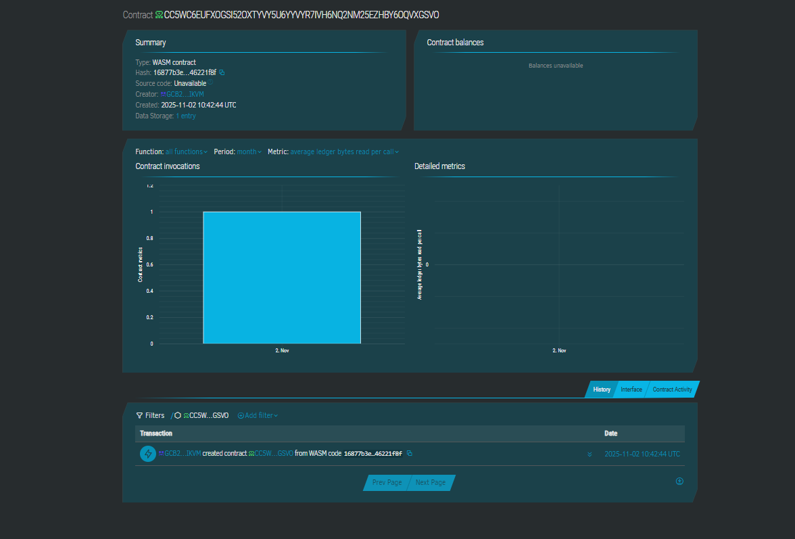

# 🎯 LeetCode Challenge Betting Platform – Gamify Your Coding Journey

## Project Description

The LeetCode Challenge Betting Platform is a decentralized smart contract solution built on the Stellar blockchain using Soroban SDK. This innovative platform allows users to stake XLM on their ability to complete coding challenges, creating a powerful accountability mechanism that transforms coding practice into a high-stakes, rewarding experience. The smart contract acts as a trustless escrow, holding funds until challenge completion is verified by the admin, then automatically distributing rewards based on performance outcomes.

## Project Vision

Our vision is to revolutionize how developers approach skill development and maintain coding discipline through financial accountability. We aim to:

- **Gamify Skill Development**: Transform routine coding practice into an engaging, high-stakes challenge with real financial incentives
- **Build Accountability Systems**: Create financial commitment mechanisms that dramatically increase follow-through rates on learning goals
- **Promote Consistent Practice**: Encourage daily/weekly coding habits through stake-based motivation rather than willpower alone
- **Reward Achievement**: Enable developers to earn back their stakes plus potential bonuses for completing their coding challenges
- **Foster Competitive Spirit**: Create a transparent leaderboard system where top performers gain recognition and credibility
- **Establish Trust Through Blockchain**: Ensure transparent, immutable, and automated fund management without intermediaries

## Key Features

### 1. Challenge Creation & Staking
- Users create personalized coding challenges with custom stake amounts in XLM
- Flexible challenge parameters including deadline, difficulty level, and problem count
- Each challenge is uniquely tracked on-chain with a verifiable challenge ID
- Minimum and maximum stake limits to ensure fair participation
- Automated challenge counter for easy tracking and reference

### 2. Secure Escrow System
- Smart contract holds staked XLM in trustless escrow until challenge completion
- Funds cannot be withdrawn or manipulated during the challenge period
- Automatic timestamp validation ensures challenges are evaluated only after deadlines
- Prevents double-settlement through built-in settlement status checks
- Immutable transaction records provide complete transparency

### 3. Admin Verification System
- Authorized admin reviews LeetCode submissions and verifies challenge completion
- Binary success/failure verification with timestamp validation
- Admin authentication ensures only authorized parties can verify outcomes
- Challenge details include user address, stake amount, and completion status
- Manual verification allows for nuanced evaluation of complex coding challenges

### 4. Automated Fund Distribution
- Smart contract automatically determines winner based on verification results
- Successful completion returns stake to user's wallet
- Failed challenges route funds to platform treasury for operations
- Instant, trustless payouts without manual intervention
- Transparent winner retrieval function for frontend integration

### 5. Comprehensive Challenge Tracking
- Real-time monitoring of all active, completed, and failed challenges
- Historical challenge records with complete audit trails
- User-specific challenge history for tracking progress over time
- Platform-wide statistics including total stakes, completion rates, and active users
- Challenge counter provides quick reference for total platform activity

### 6. Platform Treasury Management
- Failed stakes accumulate in platform treasury for sustainability
- Treasury funds support platform development, marketing, and operations
- Transparent treasury address visible on-chain for accountability
- Potential future features include reward pools and community incentives
- Admin controls ensure proper fund management and security

## Future Scope

### Short-term Enhancements (3-6 months)

- **Difficulty Tiers**: Implement variable reward multipliers based on problem difficulty (Easy 1x, Medium 1.5x, Hard 2x)
- **Streak Bonuses**: Reward consecutive successful challenges with bonus XLM from treasury pool
- **Challenge Templates**: Pre-configured challenge types (Daily Problem, Weekly Sprint, Monthly Marathon)
- **Proof Automation**: Integrate LeetCode API for automated submission verification (if available)
- **Email Notifications**: Alert users of approaching deadlines and verification results
- **Social Sharing**: Generate shareable certificates for completed challenges
- **Challenge Statistics**: Personal dashboard showing win rate, total earned, and longest streaks

### Mid-term Development (6-12 months)

- **Multi-User Challenges**: Enable group challenges where teams stake collectively and share rewards
- **Dynamic Staking**: Allow users to increase stakes mid-challenge for higher potential returns
- **NFT Achievement Badges**: Mint unique NFTs for milestone achievements (100 problems, 30-day streak, etc.)
- **Leaderboard System**: Global rankings based on stakes won, problems solved, and consistency
- **Challenge Marketplace**: Allow users to create sponsored challenges with community-funded prize pools
- **Partial Completion Rewards**: Return percentage of stake based on partial completion (e.g., 70% of problems = 70% stake back)
- **Mentor Matching**: Connect users with mentors who can help with specific problem-solving strategies
- **Smart Recommendation Engine**: Suggest optimal stake amounts based on user history and problem difficulty
- **Mobile App**: Native iOS and Android applications for on-the-go challenge management

### Long-term Vision (12+ months)

- **Cross-Platform Integration**: Expand beyond LeetCode to include HackerRank, CodeForces, and other platforms
- **DAO Governance**: Community voting on platform fees, verification standards, and feature priorities
- **Algorithmic Verification**: Machine learning models to auto-verify submissions based on code quality metrics
- **Corporate Partnerships**: Enable companies to sponsor challenge pools for recruitment and talent discovery
- **Peer Verification**: Decentralized verification where multiple community members validate submissions
- **Challenge Streaming**: Live-stream coding sessions for high-stakes challenges with audience engagement
- **Educational Content**: Integrate video tutorials and solution explanations for failed challenges
- **Career Integration**: Connect high performers with job opportunities and freelance gigs
- **Token Economics**: Introduce platform-native token with staking, governance, and liquidity features
- **Insurance Layer**: Optional insurance purchased with small fees to reduce risk of total stake loss
- **Analytics Platform**: Comprehensive data insights for employers, educators, and researchers
- **API for Third Parties**: Allow external apps to integrate challenge creation and tracking

### Technical Improvements

- **Gas Optimization**: Minimize transaction costs through efficient smart contract design patterns
- **Batch Operations**: Enable multiple challenges to be created or verified in single transactions
- **Enhanced Security Audits**: Regular third-party audits and community bug bounty programs
- **Scalability Solutions**: Layer-2 integration for handling thousands of concurrent challenges
- **Oracle Integration**: Implement Chainlink or Band Protocol for automated external data verification
- **Multi-Signature Admin**: Require multiple admin approvals for sensitive operations
- **Emergency Pause**: Circuit breaker functionality for security incidents
- **Upgrade Mechanism**: Proxy patterns for seamless contract upgrades without migration
- **Cross-Chain Bridge**: Enable challenges with stakes in multiple cryptocurrencies
- **Decentralized Storage**: IPFS integration for storing challenge proofs and submission screenshots

---

## 🚀 Getting Started

### Prerequisites

- **Rust** (latest stable version)
- **Node.js** (v16 or higher)
- **npm** or **yarn**
- **Stellar wallet** (Freighter recommended)
- **Soroban CLI** (for contract deployment)
- **LeetCode account** (for completing challenges)

### Installation

1. **Clone the repository**
   ```bash
   git clone https://github.com/yourusername/leetcode-challenge-betting.git
   cd leetcode-challenge-betting
   ```

2. **Install contract dependencies**
   ```bash
   cd contracts
   cargo build --target wasm32-unknown-unknown --release
   cd ..
   ```

3. **Install frontend dependencies**
   ```bash
   cd frontend
   npm install
   cd ..
   ```

4. **Configure environment variables**
   ```bash
   cp .env.example .env
   # Edit .env with your Stellar network, admin address, and platform treasury address
   ```

### Deployment

1. **Deploy the smart contract**
   ```bash
   cd scripts
   soroban contract deploy \
     --wasm ../contracts/target/wasm32-unknown-unknown/release/challenge_contract.wasm \
     --source <YOUR_SECRET_KEY> \
     --network testnet
   ```

2. **Initialize the contract**
   ```bash
   soroban contract invoke \
     --id <CONTRACT_ID> \
     --source <YOUR_SECRET_KEY> \
     --network testnet \
     -- initialize \
     --admin <ADMIN_ADDRESS> \
     --platform_address <PLATFORM_TREASURY_ADDRESS>
   ```

3. **Run the frontend locally**
   ```bash
   cd frontend
   npm run dev
   ```

4. **Access the application**
   
   Open your browser and navigate to `http://localhost:5173` (or the port shown in terminal)

---

## 📁 Project Structure

```
leetcode-challenge-betting/
├── contracts/
│   ├── challenge_contract.rs  # Core smart contract for challenge betting
│   └── Cargo.toml             # Rust dependencies and configuration
│
├── frontend/
│   ├── src/
│   │   ├── index.html         # Main application interface
│   │   ├── app.js             # Frontend application logic
│   │   ├── styles.css         # UI styling
│   │   └── components/
│   │       ├── wallet.js      # Wallet connection & management
│   │       ├── challenge-creator.js # Challenge creation interface
│   │       ├── challenge-tracker.js # Active challenge monitoring
│   │       └── leaderboard.js # User rankings and statistics
│   ├── package.json           # Frontend dependencies
│   └── vite.config.js         # Build configuration
│
├── scripts/
│   ├── deploy.js              # Smart contract deployment script
│   └── initialize.js          # Contract initialization script
│
├── tests/
│   └── challenge_contract.test.js # Smart contract test suite
│
├── .env.example               # Environment variable template
├── package.json               # Project dependencies
└── README.md                  # This file
```

---

## 💡 Usage

### For Challenge Participants

1. **Connect Wallet**: Link your Stellar wallet (Freighter or Albedo) to the platform
2. **Create Challenge**: Define your coding goal (number of problems, deadline, difficulty)
3. **Stake XLM**: Deposit your stake amount to the smart contract escrow
4. **Complete Challenges**: Solve your LeetCode problems before the deadline
5. **Submit Proof**: Provide LeetCode profile URL or screenshots showing completion
6. **Await Verification**: Admin reviews your submission and verifies completion
7. **Receive Payout**: Successful completion automatically returns your stake to your wallet

### For Platform Administrators

1. **Monitor Dashboard**: Track all active challenges requiring verification
2. **Review Submissions**: Check LeetCode profiles and submission proofs
3. **Verify Outcomes**: Use admin authentication to mark challenges as successful or failed
4. **Process Payouts**: Smart contract automatically distributes funds based on your verification
5. **Manage Treasury**: Monitor platform funds and plan community rewards

---

## 🔧 Smart Contract Functions

### Public Functions

- **`initialize(admin: Address, platform_address: Address)`**: Initialize contract with admin and treasury addresses
- **`create_challenge(user: Address, stake_amount: i128, end_date: u64) -> u64`**: Create new challenge and return challenge ID
- **`get_challenge(challenge_id: u64) -> Challenge`**: Retrieve challenge details by ID
- **`get_counter() -> u64`**: Get total number of challenges created
- **`get_admin() -> Address`**: Retrieve admin address
- **`get_platform() -> Address`**: Retrieve platform treasury address

### Admin-Only Functions

- **`verify_challenge(challenge_id: u64, success: bool)`**: Verify challenge completion (admin authentication required)
- **`get_winner(challenge_id: u64) -> Address`**: Get winner address after verification (user if successful, platform if failed)

### Challenge Data Structure

```rust
pub struct Challenge {
    pub id: u64,              // Unique challenge identifier
    pub user: Address,        // Participant's Stellar address
    pub stake_amount: i128,   // Amount staked in stroops (1 XLM = 10,000,000 stroops)
    pub end_date: u64,        // Unix timestamp of challenge deadline
    pub is_completed: bool,   // True if user completed challenge
    pub is_settled: bool,     // True if challenge has been verified and settled
}
```

---

## 🧪 Testing

The contract includes comprehensive unit tests covering success and failure scenarios:

```bash
cd contracts
cargo test
```

**Test Coverage:**
- ✅ Contract initialization
- ✅ Challenge creation with authentication
- ✅ Successful challenge verification and payout
- ✅ Failed challenge verification and treasury routing
- ✅ Duplicate settlement prevention
- ✅ Premature verification prevention
- ✅ Admin authorization checks

---

## 🤝 Contributing

We welcome contributions from the community! Here's how you can help:

1. **Fork the repository**
2. **Create a feature branch** (`git checkout -b feature/amazing-feature`)
3. **Commit your changes** (`git commit -m 'Add amazing feature'`)
4. **Push to the branch** (`git push origin feature/amazing-feature`)
5. **Open a Pull Request**

### Contribution Ideas

- Frontend improvements and UI/UX enhancements
- Additional challenge types and templates
- Integration with other coding platforms
- Automated verification systems
- Mobile application development
- Documentation and tutorial content
- Security audits and bug reports
- Community engagement features

---


contract add:CC5WC6EUFXOGSI52OXTYVY5U6YYVYR7IVH6NQ2NM25EZHBY6OQVXGSVO


